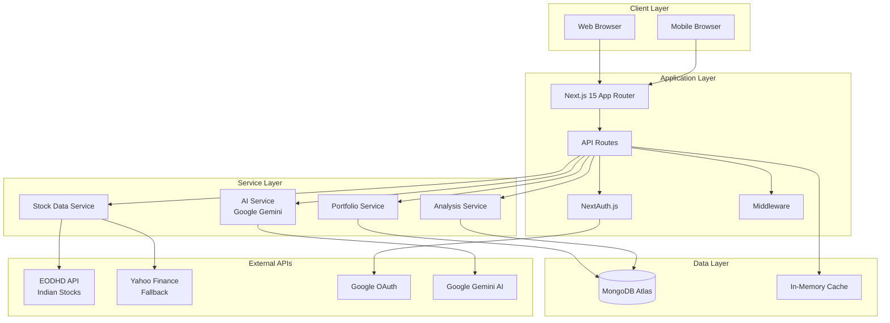
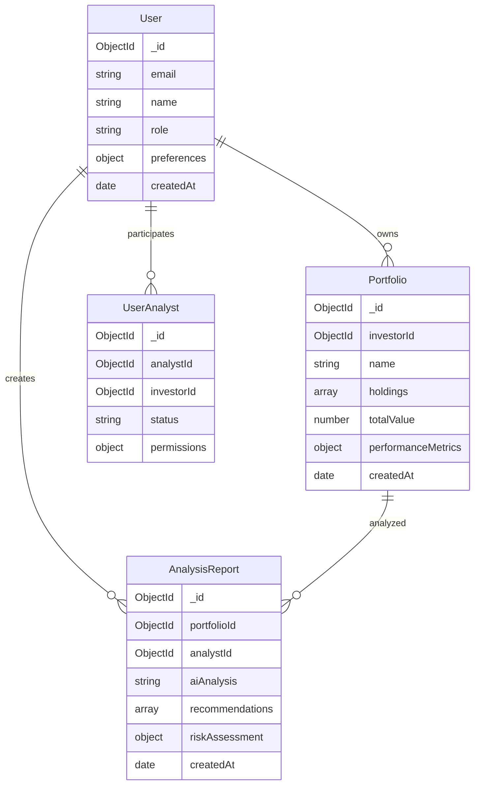
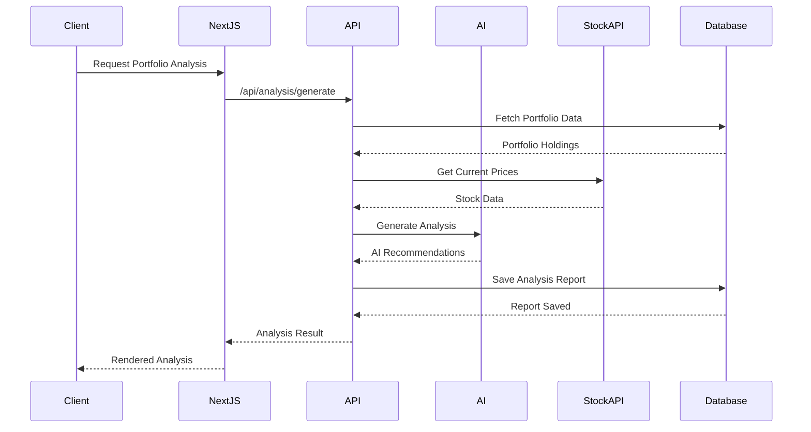
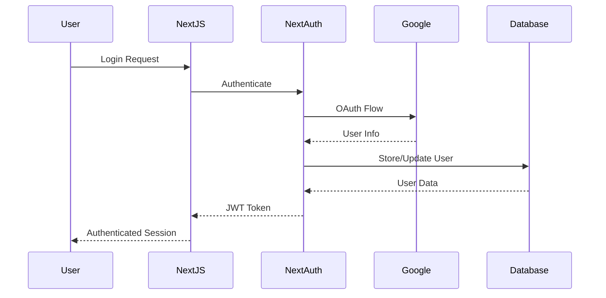
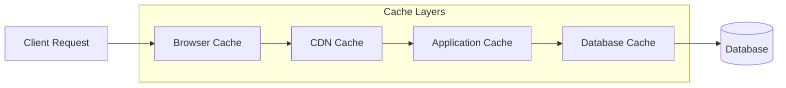
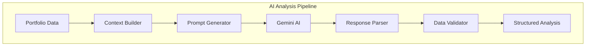
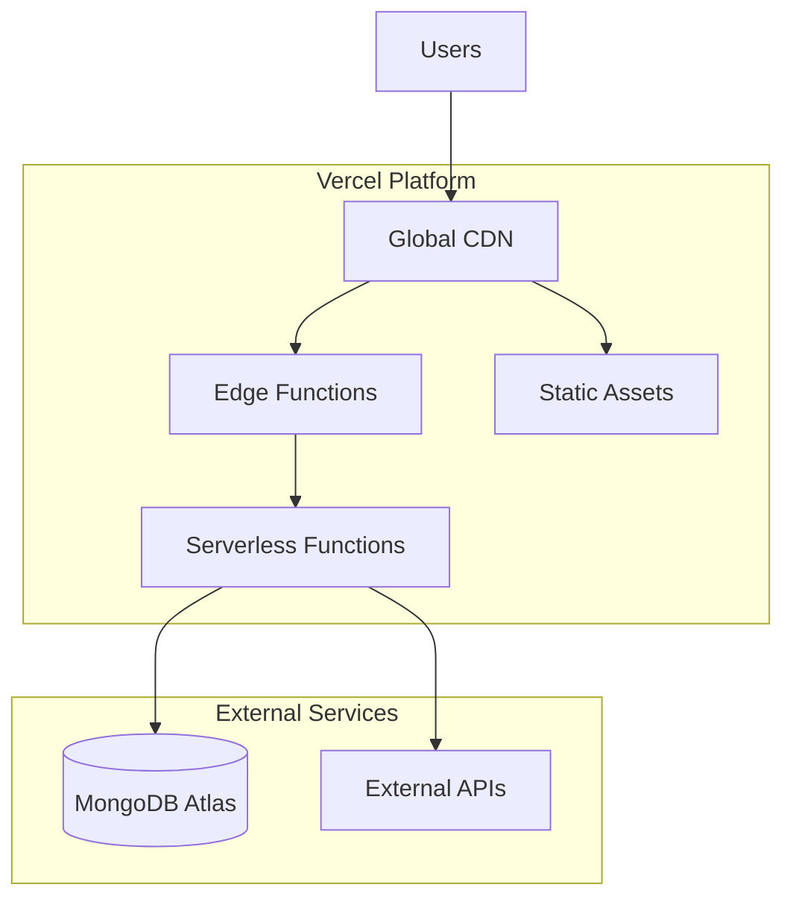

# System Architecture Overview

This document provides a comprehensive overview of the Stock Analysis Platform's system architecture, design principles, and technical implementation.

## 🏗️ High-Level Architecture

### System Components



## 🔧 Technology Stack

### Frontend Technologies
- **Framework**: Next.js 15 with App Router
- **UI Library**: React 18 with TypeScript
- **Styling**: Tailwind CSS with dark mode support
- **3D Graphics**: Three.js with React Three Fiber
- **Charts**: D3.js, Chart.js, React-Chartjs-2
- **Animations**: Framer Motion
- **State Management**: React Hooks and Context API

### Backend Technologies
- **Runtime**: Node.js 18+
- **Framework**: Next.js API Routes
- **Database**: MongoDB Atlas with Mongoose ODM
- **Authentication**: NextAuth.js with JWT
- **AI Integration**: Google Gemini 2.0 Flash
- **Stock Data**: EODHD API, Yahoo Finance API

### Infrastructure
- **Hosting**: Vercel (Serverless)
- **Database**: MongoDB Atlas (Cloud)
- **CDN**: Vercel Edge Network
- **Monitoring**: Built-in Vercel Analytics

## 📊 Data Architecture

### Database Schema Design



### Data Flow Architecture



## 🔐 Security Architecture

### Authentication Flow



### Security Layers
1. **Transport Security**: HTTPS/TLS encryption
2. **Authentication**: NextAuth.js with OAuth and credentials
3. **Authorization**: Role-based access control (RBAC)
4. **Input Validation**: Zod schema validation
5. **Rate Limiting**: API endpoint protection
6. **Data Encryption**: MongoDB Atlas encryption at rest

## 🚀 Performance Architecture

### Caching Strategy



### Performance Optimizations
- **Code Splitting**: Automatic with Next.js
- **Image Optimization**: Next.js Image component
- **Static Generation**: Pre-rendered pages where possible
- **API Caching**: 5-minute TTL for stock data
- **Database Indexing**: Optimized queries
- **Connection Pooling**: MongoDB connection management

## 🔄 API Architecture

### RESTful API Design

```
/api/
├── auth/                 # Authentication endpoints
│   ├── signin
│   ├── signout
│   └── session
├── portfolios/           # Portfolio management
│   ├── GET /             # List portfolios
│   ├── POST /            # Create portfolio
│   ├── GET /:id          # Get portfolio
│   ├── PUT /:id          # Update portfolio
│   └── DELETE /:id       # Delete portfolio
├── stocks/               # Stock data endpoints
│   ├── indian            # Indian stock data
│   ├── quote             # Stock quotes
│   ├── search            # Stock search
│   ├── historical/:symbol # Historical data
│   └── technical/:symbol  # Technical indicators
├── analysis/             # AI analysis endpoints
│   └── generate          # Generate analysis
├── reports/              # Report management
│   ├── GET /             # List reports
│   ├── GET /:id          # Get report
│   └── POST /            # Create report
└── dashboard/            # Dashboard data
    └── stats             # Dashboard statistics
```

### API Response Format
```json
{
  "success": true,
  "data": {
    // Response data
  },
  "pagination": {
    "total": 100,
    "limit": 50,
    "skip": 0,
    "hasMore": true
  },
  "metadata": {
    "timestamp": "2024-01-15T10:30:00Z",
    "source": "EODHD API",
    "processingTime": 150
  }
}
```

## 🤖 AI Integration Architecture

### AI Service Design



### AI Analysis Components
1. **Context Builder**: Aggregates portfolio, market, and user data
2. **Prompt Generator**: Creates structured AI prompts
3. **AI Service**: Interfaces with Google Gemini API
4. **Response Parser**: Extracts structured data from AI responses
5. **Validator**: Ensures data quality and completeness

## 📱 Frontend Architecture

### Component Architecture

```
src/components/
├── layout/               # Layout components
│   ├── Navbar
│   ├── Sidebar
│   └── Footer
├── dashboard/            # Dashboard components
│   ├── PortfolioSummary
│   ├── StockList
│   └── PerformanceCharts
├── portfolio/            # Portfolio components
│   ├── PortfolioCard
│   ├── HoldingsList
│   └── AddHolding
├── analysis/             # Analysis components
│   ├── AIAnalysis
│   ├── RecommendationCard
│   └── RiskAssessment
├── charts/               # Chart components
│   ├── 3DPortfolioChart
│   ├── CandlestickChart
│   └── PerformanceChart
└── ui/                   # Reusable UI components
    ├── Button
    ├── Modal
    └── LoadingSpinner
```

### State Management
- **Global State**: React Context for user session and theme
- **Local State**: React Hooks for component-specific state
- **Server State**: SWR for API data fetching and caching
- **Form State**: React Hook Form for form management

## 🔄 Deployment Architecture

### Serverless Deployment



### Deployment Benefits
- **Auto-scaling**: Automatic scaling based on demand
- **Global Distribution**: Edge locations worldwide
- **Zero Configuration**: No server management required
- **Instant Deployments**: Git-based deployment workflow

## 📊 Monitoring and Observability

### Monitoring Stack
- **Application Monitoring**: Vercel Analytics
- **Error Tracking**: Built-in error boundaries
- **Performance Monitoring**: Web Vitals tracking
- **API Monitoring**: Response time and error rate tracking

### Logging Strategy
- **Structured Logging**: JSON-formatted logs
- **Log Levels**: Error, Warn, Info, Debug
- **Request Logging**: API request/response logging
- **Error Logging**: Comprehensive error tracking

## 🔧 Development Architecture

### Development Workflow
1. **Local Development**: Next.js dev server with hot reloading
2. **Code Quality**: ESLint, Prettier, TypeScript
3. **Testing**: Jest, React Testing Library
4. **Version Control**: Git with feature branch workflow
5. **CI/CD**: Vercel automatic deployments

### Code Organization
- **Feature-based Structure**: Organized by business features
- **Separation of Concerns**: Clear separation between layers
- **Reusable Components**: Modular and composable components
- **Type Safety**: Comprehensive TypeScript coverage

---

This architecture provides a scalable, maintainable, and secure foundation for the Stock Analysis Platform, supporting both current requirements and future growth.
